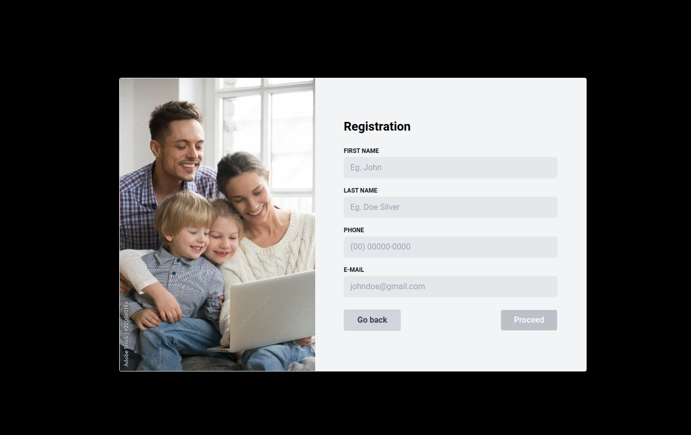

This is a [Next.js](https://nextjs.org/) project bootstrapped with [`create-next-app`](https://github.com/vercel/next.js/tree/canary/packages/create-next-app).

## App



<video width="800" height="600" autoplay loop controls>
  <source src="assets/readmeFiles/video.mp4" type="video/mp4">
</video>

</br>

## :black_circle: Getting Started

First, run the development server:

```bash
npm run dev
# or
yarn dev
```

Open [http://localhost:3000](http://localhost:3000) with your browser to see the result.

</br>

## :large_blue_circle: Technologies

- [NextJS](https://nextjs.org/)
- [Typescript](https://www.typescriptlang.org/)
- [React-Hook-Form](https://react-hook-form.com/)
- [Zod](https://zod.dev/)
- [Tailwind](https://tailwindcss.com/)
- [Eslint](https://eslint.org/)

</br>

## :bookmark_tabs: Tasks
- [x] Configure tailwind on the project
- [x] Add free image asset to represent the suggested layout
- [x] Config head and project title
- [x] Create buuton at home to navigate to form
- [x] Create form with field required (firstName, lastName, phone, email)
- [x] Configure react-hhok-form to control inputs
- [x] Handle dynamic errors by input
- [x] Configure zod to validate input values
- [x] Add mask at phone input
- [x] Block submit button until all inputs are filled correctly
- [x] Reset fields after submit

</br>

## Deploy on Vercel

The easiest way to deploy your Next.js app is to use the [Vercel Platform](https://vercel.com/new?utm_medium=default-template&filter=next.js&utm_source=create-next-app&utm_campaign=create-next-app-readme) from the creators of Next.js.

Check out our [Next.js deployment documentation](https://nextjs.org/docs/deployment) for more details.
